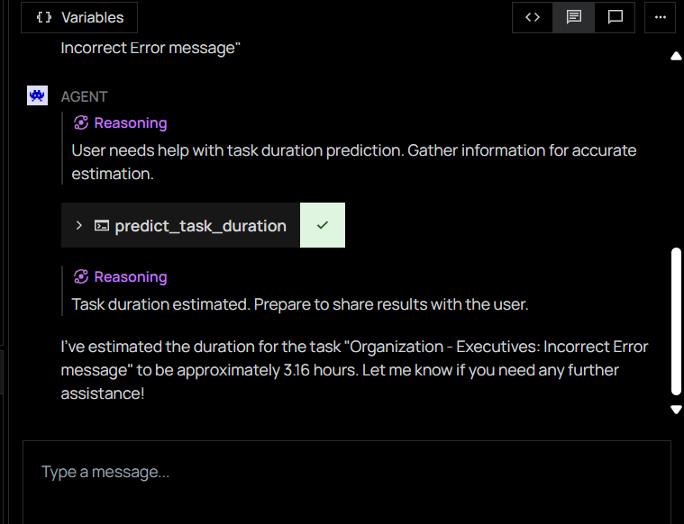

# Letta Agent
This will servee as a demo on how task estimation can be used for a Letta Agent.
We can do either of the following:

1. Add a tool call that receives inference from a different server which houses the task estimation model.
2. Compile all task information and pass them to an All-mini-lm-v2 for fine-tuning which in turn will give the
   results which we can store to a psql-pgvector. A tool call will be created to perform information retreival on this
   database to extract task hours from a task that is semantically closest to the user's query via cosine similarity.

